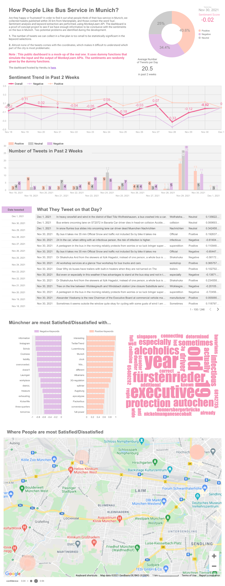

# How People Like Munich Bus Service   - Dashboard Comparison

We compare two tech stacks in deploying almost identical
dashboards. The dashboard is to show the sentiment in the tweets about
the bus service in Munich. The detail of the dashboard is discussed
[here](https://github.com/megnergit/MunichBusService_Heroku_S2).

The dashboard on Data Studio can be seen [here](https://datastudio.google.com/reporting/6e3d878f-af93-44f4-9713-8adef3931dad/page/yAbgC)(not updated). 

Here is the screenshot. 

## Strearmlit + Heroku versus Data Studio by Google Cloud

We will compare two dashboards: one built on Streamlit + Heroku and
the other on Data Studio by Google. Both of them are 

- free (cost null)

- use Python (and Python only) as a backend to perform
   + data acquisition
   + data analysis (sentiments / keyword extraction)

-------------------------------------------

## Summary of Tech Stack

tasks              | Streamlit + Heroku         | Data Studio
-------------------|----------------------------|----------------------
Coding             | Python                     | Python
Data Collection    | Twitter API                | Twitter API
Translation        | DeepL API                  | DeepL API
Sentiment Analysis | MonkeyLearn API            | MonkeyLearn API
Keyword Extraction | MonkeyLaern API            | MonkeyLearn API
Data Transfer      | -                          | gspread (Google Sheets API)
Data Storage       | local. pandas csv          | Google Sheets 
Visualization      | plotly, folium, wordcloud  | Data Studio
Web Authoring      | Streamlit                  | Data Studio
Deployment         | Heroku                     | Data Studio

-------------------------------------------
## Pros and Cons

We will discuss

1. Data Studio - Cons
2. Data Studio - Pros
3. Streamlit + Heroku - Cons
4. Streamlit + Heroku - Pros

in this order. 

-------------------------------------------
### 1. Data Studio Cons

- A big disappointment is that there are a few things Data Studio
  cannot do, which are rather simple, and quite unexpected. Assume you
  have two columns in your spread sheet, and would like a scatter plot
  with one column as x-axis, and the other column as y-axis. I could
  not find how to do so in Data Studio. The reason is that Data Studio
  plots **aggregate**. Aggregate is a sum, average, count, min, max,
  i.e., results of statistical calculations. The y-axis values have to
  be aggregated before they are plotted. There is no option not to
  apply the aggregation, and to plot the values as they are (there are
  old instructions on the web, that one can choose 'None' in
  aggregation, but there is no such option in the UI any more). One
  should therefore prepare the data, so that Data Studio can aggregate
  as a last step before plotting. You should not aggregate the data
  yourself, but you have to leave this one step so that Data Studio can
  do so. If your data is not of the nature of aggregation, you have to
  modify it, so that the values you would like to plot will be an
  aggregate. Alternatively, one can aggregate, and reverse the
  calculation, like dividing summed-up data with the number of
  samples. One can also design the data so that aggregation will happen
  with the sub-sample size always n=1. All of these sound absurd to
  me.

- Options are too few in making diagrams. Every option that one can use
  on Data Studio are on GUI. The number of options are inevitably
  limited as we cannot play efficiently with a pull down menu with 100
  options. In the case of `plotly` you can just list up 100 options in
  the documentation, and let a user read it. These missing options
  that frustrated me are

      + format of date and time in diagram, like adding day of week
      + font size in tooltips
      + gaps between bars in bar charts

- GUI does not necessarily mean a software is easy to use. The
  problem in a GUI is, it takes long to find out something is
  **impossible**. You have to click all buttons and scroll down all
  pull-down menus to the bottom before you finally find you do not
  have that option. Even if something is possible, if the function is
  stored deep inside the menu trees in the nested pull down menus, it
  is hard to find it out. It took me long until I found out how to
  aggregate the data taken on one day before (so that the date range
  continuously shifts with respect to today).

- I could not get used to the 'feeling' of Data Studio. One might
  rephrase that feeling as discomfort in UI design. It comes from
  different sources. It is the naming of the items, choice of the
  defaults, and others. When I updated the spread sheet with new data,
  and 'add' it to a diagram, the filename is just added to the list of
  previously added files in a menu. In the end, I saw a long list of
  identical filenames, as I updated the spread sheet many times.
  
  Other things that I could not get used to are

     + Number of clicks to reach to a function I need is too large,
       for instance, just to change a color of a chart.

     + You have to 'group', a control and a visualization to 'assign'
       the control to the visualization, which I found not intuitive.
    
     + Similar tasks are stored in multiple places, and sometimes wide
       apart. For instance, in order to set an interval in which the
       data should be aggregated for the **entire** dashboard, one has
       to go File -> Report Setting in the menu bar. If you want to do
       so, however, for **one component**, you will go 'DATA ' on the
       right panel -> Default date range -> Custom.

- I had difficulties to understand the documentations of Data
  Studio. The style of writing is of typical 'uncool' documents that
  explain GUI in text, like 'go to the right panel, click the picture
  of a pencil on the left of the filename...'

- Data Studio is more like a hand work, similar to PowerPoint. You
  will manually place components on your canvas. They are off by the
  amount of the preciseness of hands, and did not align exactly.
  There is a 'snap to grid' option for components, but not for text
  boxes.

- You need some practice to authenticate an access to Google Sheets
  from your local laptop. One need to understand the concepts of
  service account, credentials, spreadsheet key.

-------------------------------------------

### 2. Data Studio Pros

- Flexible placement of the components. This part of creating a
  dashboard on Data Studio is really look-and-feel in a positive
  sense. How to place a component on your canvas is similar to when you
  use PowerPoint. If you would like some text on your canvas, you just
  create a text box and type in it.

- Once the access to a Google Sheets on the cloud is established, one
  can upload a local csv from Python code. No complication. One can
  also automate the process.

- Details of the implementation of diagrams differ from that of
  `plotly`, and sometimes are better. For instance, the tooltips look
  nicer in Data Studio.

- Deployment and sharing the dashboard is seamlessly connected from the
  authoring it. It is much the same with when you share a document on
  your Google Drive.

- It is straightforward to add a control to each component to make the
  dashboard interactive (once you learn how to do so).

- One can use Google Map in a dashboard. 

- One can replace Google Sheets with BigQuery, and possibly with
  Cloud Storage on the backed, to put the whole system on the Goole
  Cloud Platform (I will try this next). Because the data size of this
  dashboard is currently small, the system can be maintained within
  the free tier that costs nothing during the operation.

-------------------------------------------
### 3. Streamlit + Heroku Cons

- The biggest constraint in authoring a web app with Streamlit is the
  layout. Streamlit has only column structure, and does not allow a
  column to have multiple depth, i.e., no nested columns. Therefore
  one can place following four components with different sizes and
  shapes in the layout below,

   AA BC
   AA BD

  ('AAAA' is a one big component. 'BB' is a one vertically elongated
  component). The layout is considered as 3-column, and you can put
  any component from top to bottom through each column.

  However, we cannot place them in the following layout.

   AA BB
   AA CD

  where 'BB' is a one horizontally elongated component. Here one
  cannot separate C and D, because the column of B cannot be split
  further into two columns.
  
- You need Heroku to host your dashboard, while in the case of Data
  Studio, authoring and deployment are fused together. The
  authentication to access to Heroku server needs some practice.

- The dashboard app will be built on the server hosted at Heroku. In
  the case of a built error, you might get stuck.

- The options in touching up text are limited. For instance, if you
  would like to change the color of a part of the text, you need to
  write it in HTML.

- Putting whole system on a public cloud is not as straightforward as
  in the case of Data Studio.

-------------------------------------------

4. Streamlit + Heroku Pros

- The column-only structure is a restriction, but in the same time it
  enables a clean, simple, layout with edges perfectly aligned.

- The authoring is done by a combination of individual visualization
  library and Streamlit. Here we used `plotly`, `folium`, and `wordcloud`,
  but there are many more choices in visualization in Python
  (`matplotlib`, `seaborn`, `bokeh`, etc). You are free to pick one that
  fits you good.

  In the consequence, we have much more options in making a figure. We
  can adjust, for instance, we have controls on 

  + Gaps between bar plots
  + Sort, or keep the specific order of items, in pie chart
  + Size of markers in line plot

- The default designs of components are beautiful from the point of
  view of the industrial design.

- Programmatical editing of text. One can change the contents of text,
  according to the results of your analysis. For instance, you can
  embed the statistics in the text, and change them automatically as
  the page is updated.

- Whole system is integrated in Python with bare minimum knowledge of
  HTML. This gives you a great feeling of freedom. When something is
  not clear, you do not need to flip all the stones (click every
  button with mouse), but just type in `help(function)`.

-------------------------------------------
# Conclusion

I prefer Streamlit + Heroku better to Data Studio. In short, it is
like a comparison between LaTex and Pages. It is typing versus click,
drag, and scroll. It is a matter of learning cost versus
performance. In the case of Streamlit, the learning cost is still low
enough, and does not motivate switching to Data Studio.

When I start designing with Streamlit + Heroku, the flow of thought
is, first think of what I would like to do, and then find out how to
do so with Steramlit + Heroku. In the case of Data Studio, one has to
first learn what are possible with Data Studio, and design what you
want to do accordingly.

Nevertheless, Data Studio has one big advantage: transition to a public
cloud. When the size of the data becomes big, moving to a cloud is not
an option, but a compulsion. One should any case prepared for it.

-----------------------------------------------------------------
# What the App does

1. Collect tweets that

   - contain the word 'bus', and 
   - are sent from 20 km from MarienPlatz. 

   Twitter API was used.

   - The majority of the tweets about a bus are from 'MVVticker'
     reporting delays, accidents, and coming back to the
     normality. Tweets by 'MVVticker' are removed.

2. Convert German texts to English, using DeepL API, for the sentiment
   analysis.

3. Sentiments and keywords are extracted from the texts. MonkeyLearn
   API was used.

   - The sentiments are weighted by the 'confidence' (that comes with
     the sentiment analysis), and are averaged to the overall
     sentiment. The neutral sentiments are removed (weighted to zero).

4. Create visualizations with Steamlit, and deploy them on Heroku.

4. Create visualizations with Data Studio, and deploy them.

-----------------------------------------------------------------
# END
